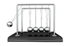

# Impulse and Collisions

### Additional Equipment

- Happy and Unhappy balls

### Objective

Data collection

- Set up appropriate experiment to measure force and motion as a function of time

Lab Skills

- 
  - Uncertainty propagation
  - Measurement Precision

- Significant Figures
- Agreement in measurements based on uncertainty

- Determine the area under the force vs. time curve compare to change in momentum 
- Region of Interest
- Data Collection Rate

Physics Concepts

- Impulse 
- Conservation of Momentum 
- Elastic and Inelastic Collisions

### Conceptual (C-Level) DONE BEFORE LAB

Suppose you wish to produce the greatest force on an object. You can throw either a bouncy ball or a non-bouncy (clay) ball. Each ball has the same mass, would interact with the object for the same amount of time, and you can throw them with the same speed.

- Using ideas of impulse and momentum, mathematically prove which ball produces the greatest force on the object (no plugging in numbers!).

 

Newton's Cradle is a toy you might have seen. It is a wooden rectangular box frame with multiple steel balls suspended next to each other in the middle such that they are free to swing horizontally.

- Suppose you have 5 steel balls suspended in the middle. If you pick 3 balls up and release them, what will happen? Why?

### Basic Lab (B-level)

Let a cart traveling on slightly inclined track hit a ball placed in front of a force probe mounted at the bottom of the track. Remove the hook on the force probe so there is a flat interaction area. Increase the data collection rate (200 pts/sec is better than 20 pts/sec) and make sure you are not exceeding the force probe range (gentle collision). There are brackets available if you want to try different arrangements.

- Record the force and motion of the cart when it collides with an elastic object (happy ball) and an inelastic object (unhappy ball).
  - Calculate the impulse from the force vs time graph
  - Calculate the change in momentum 
  - Compare for different inclines and/or speeds (how many should you have for a "good" comparison?)

### Advanced/Extended Lab Ideas (A-level)

- Determine the momentum and energy (read ahead!) before and after elastic and inelastic collisions. The carts have Velcro that can be used to stick them together. You can use two motion detectors but make sure they don't "see" each other and have cross talk confuse the position vs time data. 
  - Two cars of equal mass collide. 
  - A massive car colliding with a smaller car.
  - A smaller car colliding with a massive car 

- Propose and carry out an experiment on something you are curious about (get your lab instructor's approval first).

\eject

